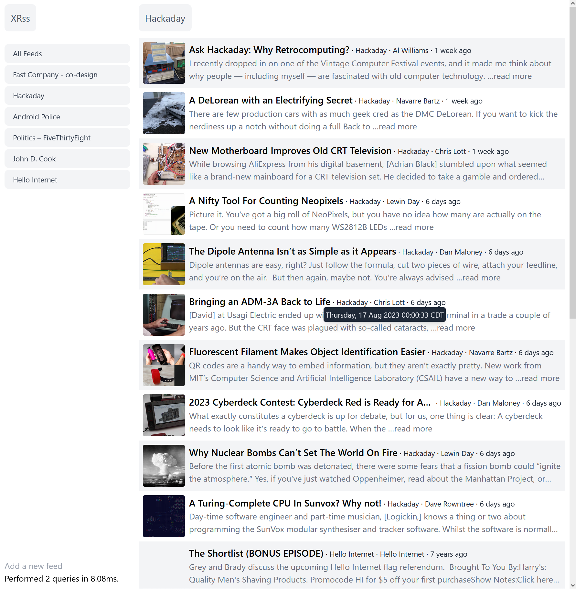

# About

This is a web-based rss reader built on top of
[caddy-xtemplate](https://github.com/infogulch/caddy-xtemplate), a php-like
hypertext preprocessor with Go html/template syntax, integrated into Caddy a
world-class web server.

Notable Features

* UI built with tailwindcss.js
* Adaptive UI suitable for small screens
* Add feeds
* Show items from all feeds or just selected feed (sometimes)
* Uses [gofeed](github.com/mmcdole/gofeed) feed reader library

Future

* Maybe eventually update feeds
* Read status, filter by read status
* Sort options
* Scrape item links; display full article content inline
* Multiple users



## Developing

```shell
# build:
GOFLAGS='-tags="sqlite_json"' CGO_ENABLED=1 go build -o xrss

# run:
./xrss --context-path context --db-driver sqlite3 --db-connstr 'file:rss.sqlite?_journal=WAL&_synchronous=NORMAL&_foreign_keys=true&_vacuum=full'

tailwindcss -i static/main.css -o static/site.css --content './templates/**/*' -w
```

## Resources

https://hurl.dev/docs/hurl-file.html

https://github.com/go-echarts/go-echarts

https://nene.github.io/prettier-sql-playground/

https://github.com/cornelk/goscrape

https://github.com/robfig/cron

7 Restful Routes: https://gist.github.com/alexpchin/09939db6f81d654af06b

https://github.com/caddyserver/xcaddy/pull/62

https://github.com/infogulch/xrss/commits/master.atom

### CSS

* https://css-tricks.com/
* https://moderncss.dev/
* https://smolcss.dev/
* https://modernfontstacks.com/

* https://classless.de/classless.css
* https://purifycss.online/
* https://tailwindcss.com/docs/
* https://www.hyperui.dev/
* Responsive layout demo: https://play.tailwindcss.com/KJTJ5n574r
* https://github.com/argyleink/open-props/
* https://yqnn.github.io/svg-path-editor/
